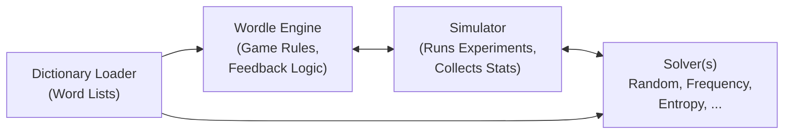
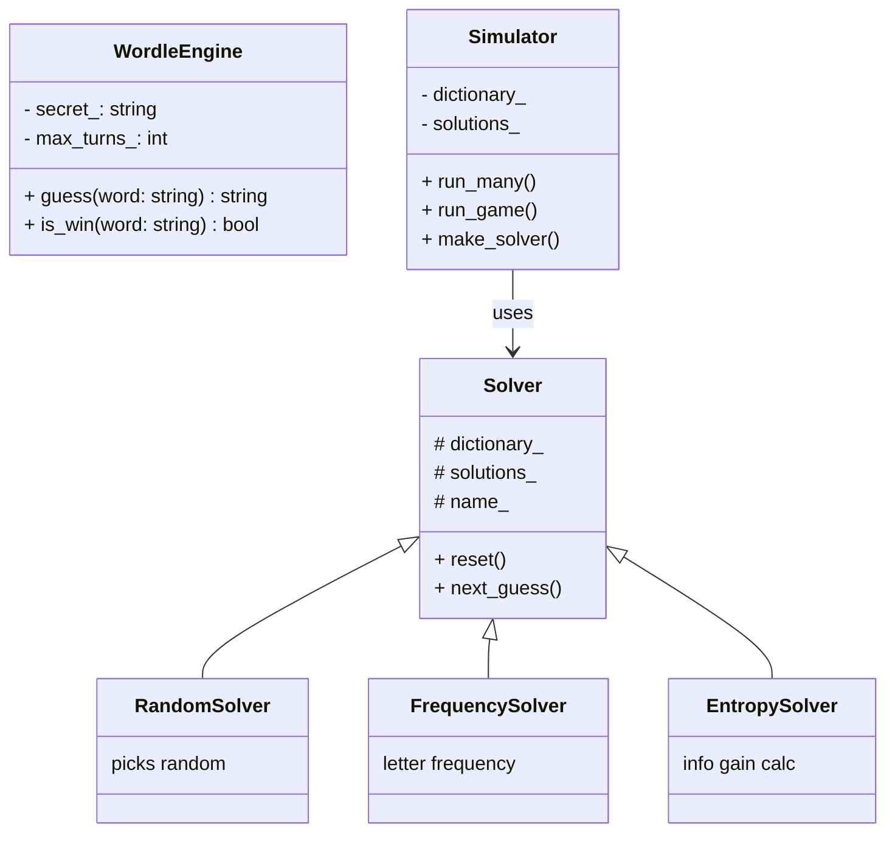
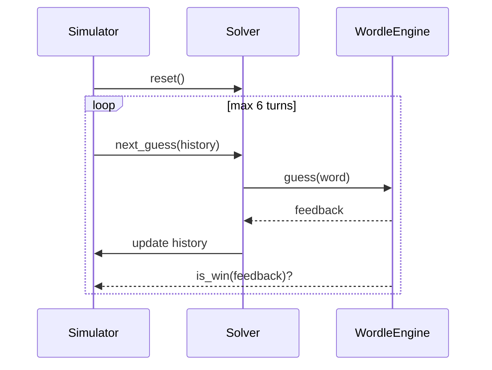

# Wordle Simulation Project – Design Document

## 1. Overview
This project implements a modular **Wordle game engine** in C++ along with a framework to test various **solver strategies** (algorithms to guess words).  

The goal is twofold:
1. **Part 1** – Implement the Wordle game mechanics (engine, feedback, validation).  
2. **Part 2** – Experiment with different solver strategies (Random, Frequency-based, Entropy, etc.) to evaluate their performance.  

The project is organized into three primary modules:
- **Engine** → Implements Wordle rules and utilities.  
- **Solver** → A family of algorithms (via Strategy Pattern).  
- **Simulator** → Runs many games, collects statistics, and compares solvers.  

---

## 2. Requirements

### Functional Requirements
- Play a Wordle game interactively (CLI).
- Load dictionary of words from file (with a fallback list).
- Implement multiple solvers that guess words automatically.
- Simulate multiple games and record:
  - Win rate
  - Average attempts
  - Distribution of attempts (1–6, fail).

### Non-Functional Requirements
- Modular and extensible (easy to add new solvers).
- Testable (unit tests for engine logic).
- Efficient enough to simulate thousands of games.
- Cross-platform build system (CMake).

---

## 3. Design Patterns Used

- **Strategy Pattern** → Each solver (Random, Frequency, Entropy, etc.) implements a common interface (`Solver`), making it easy to swap algorithms.  
- **Factory Method** → `Simulator::make_solver()` creates solvers by name.  
- **Separation of Concerns** → Engine, Solver, and Simulator modules are decoupled.  

---

## 4. System Architecture

### High-Level Block Diagram

---

### Module Breakdown

#### 4.1 Engine
- **Responsibilities**:
  - Compute feedback (Green/Yellow/Gray) according to Wordle rules.
  - Validate guesses against the dictionary.
  - Enforce game limits (6 attempts).
- **Classes**:
  - `WordleEngine`
  - `Utils` (feedback computation, dictionary handling).

#### 4.2 Solver
- **Responsibilities**:
  - Encapsulate guessing strategy.
  - Use feedback history to refine next guess.
- **Classes**:
  - `Solver` (abstract base).
  - `RandomSolver`, `FrequencySolver`, (future: `EntropySolver`, `MinimaxSolver`).

#### 4.3 Simulator
- **Responsibilities**:
  - Run games with different solvers.
  - Track performance statistics.
  - Provide CLI interface.
- **Classes**:
  - `Simulator`

---

## 5. Detailed Design

### Class Diagram



---

### Sequence Diagram (Game Flow)


### 🔍 Notes:
- `participant` defines the lifelines (`Simulator`, `Solver`, `WordleEngine`).
- `->>` is a solid arrow (call).
- `-->>` is a return/response arrow.
- `loop` creates the loop box with your `max 6 turns`.

This will render with **three lifelines**, arrows between them, and a loop box for the turn sequence.

---

---

## 6. Example Flow

**Simulation Flow (FrequencySolver, 1 game):**

1. Simulator picks a secret word from solutions.  
2. Solver resets state.  
3. Turn 1:
   - Solver picks initial guess (based on frequency).  
   - Engine returns feedback.  
4. Solver filters remaining candidates using feedback.  
5. Repeat until win or 6 turns exhausted.  
6. Simulator records result.  
7. Repeat across many games for statistics.  

---

## 7. Build & Run

```bash
mkdir build && cd build
cmake ..
make -j

# Play manually
./wordle_sim play ../data/words.txt

# Simulate 1000 games with frequency solver

./wordle_sim simulate ../data/words.txt frequency 1000
```

## 8. Future Extensions
1. Add Entropy-based Solver for optimal guessing
2. Add Minimax Solver (wrost-case minimization).
3. Implement parallel simulation (multi-threading)
4. Add GUI/Web Front-end for human play
5. Integrate unit testing framework
6. Experiment with a Reinforcement learning based strategy


